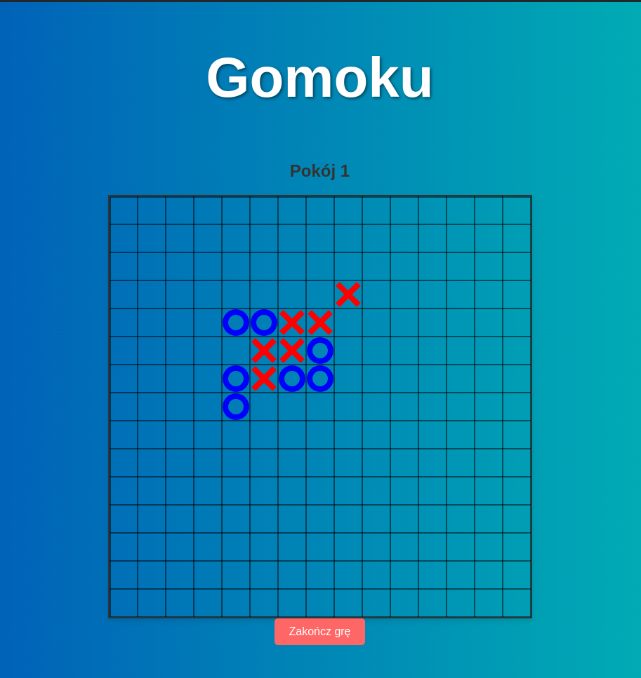

# Gra wieloosobowa Gomoku
## Opis
Gomoku toczy się na planszy do go zwanej goban, o rozmiarach 15x15. Gracze kładą na planszy na przemian po jednym swoim "kamieniu" (gracz rozpoczynający grę używa kółek, drugi krzyżyków).

Celem każdego z graczy jest ułożenie nieprzerwanego łańcucha dokładnie pięciu kamieni własnego koloru (w poziomie, pionie lub po przekątnej). Ustawienie więcej niż 5 kamieni w linii, zwane overline, nie daje wygranej.

## Implementacja gry
W projekcie jest serwer, który przechowuje statusy wszystkich aktualnie rozgrywanych gier. Klienci komunikują się z serwerem przy pomocy WebSockets. Przekazywane komunikaty są w formacie binarnym.

## Screenshots

